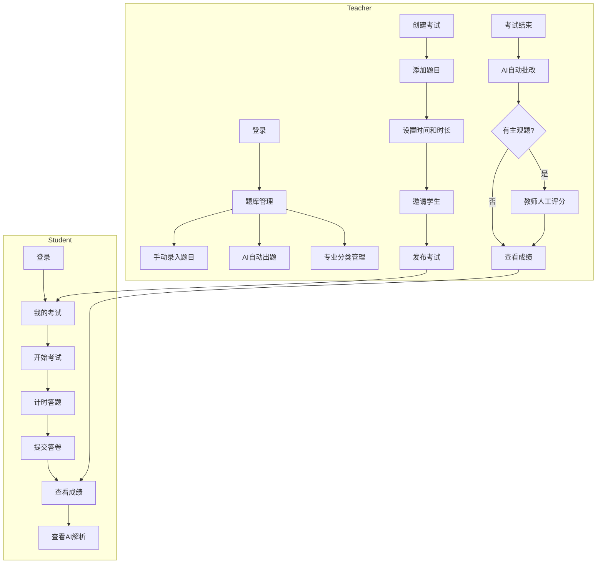
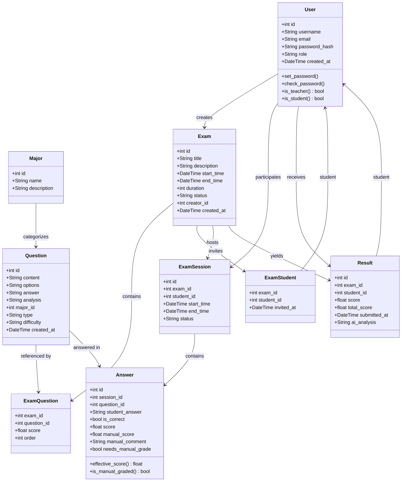
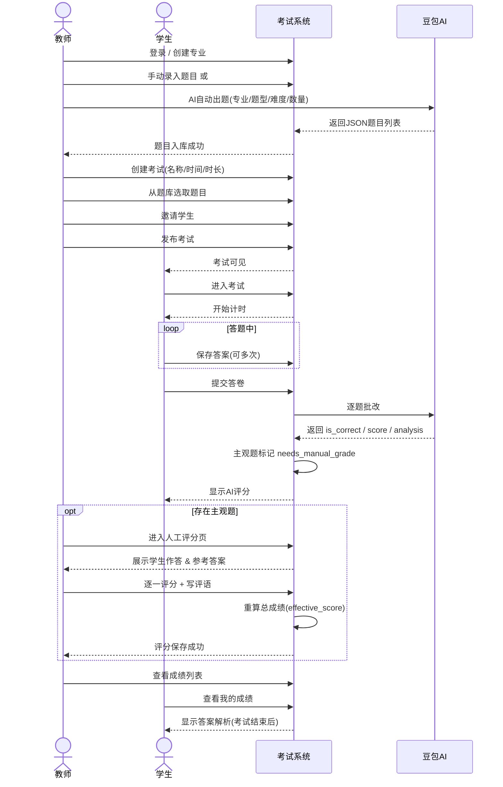
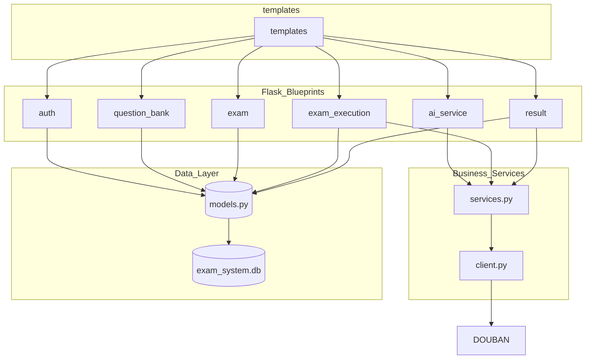
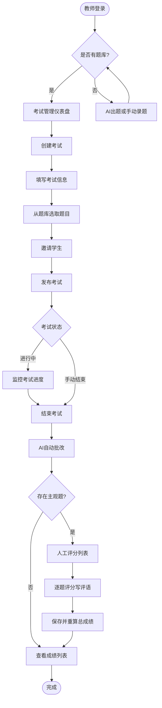
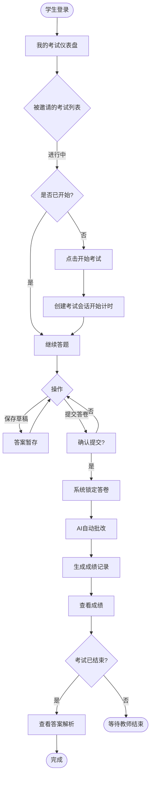
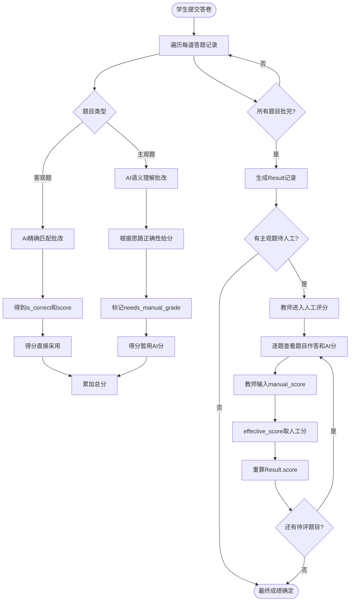

# 在线考试系统 — 开发文档

## 项目概述

基于 Flask 的角色化在线考试系统（教师/学生），集成火山引擎豆包大模型 API，支持 **AI 智能出题**、**AI 自动批改**、**AI 答案解析**，并允许教师对主观题进行 **人工复核评分**。

---

## 项目结构

```
exam_system_02/
├── .env                          # 环境变量（密钥、API地址等）
├── config.py                     # 应用配置类
├── app.py                        # Flask 应用入口 + 自动数据库迁移
├── test_ai.py                    # AI 接口测试脚本
│
├── database/                     # 数据层
│   ├── __init__.py               # SQLAlchemy 实例
│   └── models.py                 # 全部 ORM 模型定义
│
├── auth/                         # 用户认证模块
│   └── routes.py                 # 注册 / 登录 / 登出
│
├── question_bank/                # 题库管理模块
│   └── routes.py                 # 题目 CRUD、专业管理、级联删除
│
├── exam/                         # 考试管理模块
│   └── routes.py                 # 考试 CRUD、发布/结束、邀请学生、添加题目
│
├── exam_execution/               # 考试执行模块
│   └── routes.py                 # 学生答题、计时、提交
│
├── ai_service/                   # AI 服务模块
│   ├── client.py                 # 火山方舟 API 客户端
│   ├── services.py               # AI 出题 / 批改 / 解析业务逻辑
│   └── routes.py                 # AI 出题页面路由
│
├── result/                       # 成绩与评分模块
│   └── routes.py                 # 成绩查询、AI 分析、教师人工评分
│
├── instance/
│   └── exam_system.db            # SQLite 数据库文件
│
└── templates/                    # 前端模板（Jinja2 + Bootstrap 4）
    ├── layout/
    │   └── header.html           # 全局导航栏（含高亮当前页）
    ├── home.html                 # 首页（未登录）
    ├── login.html                # 登录页
    ├── register.html             # 注册页（卡片式角色选择）
    ├── ai/
    │   └── generate.html         # AI 自动出题页
    ├── questions/
    │   ├── add.html              # 添加题目
    │   ├── edit.html             # 编辑题目
    │   ├── list.html             # 题目列表（含筛选）
    │   └── majors.html           # 专业管理（含删除确认弹框）
    ├── exam/
    │   ├── dashboard.html        # 教师仪表盘（考试统计卡片）
    │   ├── create.html           # 创建考试
    │   ├── edit.html             # 编辑考试
    │   ├── add_questions.html    # 为考试添加题目
    │   ├── invite.html           # 邀请学生
    │   └── results.html          # 考试成绩列表（含人工评分入口）
    ├── execution/
    │   ├── dashboard.html        # 学生仪表盘
    │   ├── take_exam.html        # 答题界面
    │   └── result.html           # 提交后成绩
    └── result/
        ├── my_results.html       # 学生：我的成绩
        ├── exam_results.html     # 教师：某考试的成绩列表
        ├── detail.html           # 成绩详情
        ├── analysis.html         # 答案解析页
        ├── grading_list.html     # 【新】人工评分-学生列表
        └── grading_detail.html   # 【新】人工评分-逐题评分表单
```

---

## 数据库模型

### 枚举定义（`database/models.py`）

| 枚举类 | 值 | 说明 |
|---|---|---|
| **RoleEnum** | `teacher`, `student` | 用户角色 |
| **ExamStatusEnum** | `draft`, `published`, `ended` | 考试状态 |
| **QuestionTypeEnum** | `single_choice`, `multiple_choice`, `fill_blank`, `true_false`, `short_answer`, `programming`, `application`, `calculation` | 题型（8种，含主观题集 `SUBJECTIVE_TYPES`） |
| **DifficultyEnum** | `easy`, `medium`, `hard` | 难度 |

`QuestionTypeEnum` 额外提供：
- `SUBJECTIVE_TYPES`：`{short_answer, programming, application, calculation}` 主观题集合
- `is_subjective(type)`：判断是否为主观题
- `label(type)`：返回中文名称（如 `programming` → `编程题`）

### 数据表

| 表 | 关键字段 | 说明 |
|---|---|---|
| **User** | id, username, email, password_hash, role, created_at | 用户（教师/学生） |
| **Major** | id, name, description | 专业分类；`backref='major'` 关联 Question |
| **Question** | id, content, options(JSON), answer, analysis, major_id(FK), type, difficulty, created_at | 题库 |
| **Exam** | id, title, description, start_time, end_time, duration, status, creator_id(FK→User) | 考试 |
| **ExamQuestion** | exam_id(FK) + question_id(FK) 复合主键, score, order | 考试-题目关联 |
| **ExamStudent** | exam_id(FK) + student_id(FK) 复合主键, invited_at | 考试-学生邀请 |
| **ExamSession** | id, exam_id(FK), student_id(FK), start_time, end_time, status | 考试会话 |
| **Answer** | id, session_id(FK), question_id(FK), student_answer, is_correct, score(AI), manual_score(教师), manual_comment(教师评语), needs_manual_grade | 答题记录（新增人工评分字段） |
| **Result** | id, exam_id(FK), student_id(FK), score, total_score, submitted_at, ai_analysis | 考试成绩 |

`Answer` 模型提供 `effective_score` 属性：有人工评分时取人工分，否则取 AI 分。

### 模型关联关系

| 关联 | 方向 | 说明 |
|---|---|---|
| User → Exam | 一对多 | `creator` 外键，教师创建考试 |
| User → ExamSession | 一对多 | 学生参与考试会话 |
| User → Result | 一对多 | 学生拥有成绩记录 |
| Major → Question | 一对多 | `cascade='all, delete-orphan'`，删除专业时自动清除所有关联题目 |
| Exam → ExamQuestion | 一对多 | 考试包含多道题目 |
| Exam → ExamStudent | 一对多 | 考试邀请多名学生 |
| Exam → ExamSession | 一对多 | 考试产生多个会话 |
| Exam → Result | 一对多 | 考试产生多个成绩 |
| ExamSession → Answer | 一对多 | 一次会话包含多道答题记录 |

### 考试状态生命周期

```
draft（草稿）───publish───▶ published（已发布）───end───▶ ended（已结束）
```

| 状态 | 教师可操作 | 学生可见性 |
|---|---|---|
| `draft` | 编辑、添加题目、邀请学生、发布 | 不可见 |
| `published` | 查看进度、手动结束 | 可见，可进入考试 |
| `ended` | 查看成绩、人工评分、查看解析 | 可查成绩和解析 |

### 权限控制模型

系统基于 Flask-Login 实现角色权限控制，所有路由均通过 `@login_required` 装饰器保护。各模块权限规则：

| 模块 | 教师 | 学生 |
|---|---|---|
| 题库管理 | 增删改查题目、管理专业 | 不可访问 |
| 考试管理 | 创建/编辑/发布/结束自己的考试 | 不可访问 |
| 考试执行 | 不可访问 | 参加被邀请的考试 |
| AI 出题 | 调用 AI 生成题目 | 不可访问 |
| 成绩查看 | 查看自己创建的考试成绩 | 仅查看自己的成绩 |
| 人工评分 | 对自己创建的考试进行评分 | 不可访问 |

教师访问非自己创建的考试/成绩时，系统返回"无权访问"提示并重定向。

### 数据完整性与安全

- **删除安全**：题目和专业的删除操作均使用 **POST** 方法（防 CSRF）
- **级联检查**：删除专业前检查是否有关联题目，有则拒绝并提示数量
- **级联删除**：`Major → Question` 配置了 `cascade='all, delete-orphan'`
- **密码加密**：使用 Flask-Bcrypt 对密码进行哈希存储，不存储明文
- **数据库迁移**：启动时自动执行 `ALTER TABLE`（幂等），兼容已有数据库

---

## 架构设计

### Flask 蓝图注册

系统在 `app.py` 中注册 6 个 Blueprint，均无 URL 前缀，路由路径在各模块内部定义：

| Blueprint | 变量名 | 来源模块 |
|---|---|---|
| `auth_bp` | `auth` | `auth/routes.py` |
| `question_bp` | `question` | `question_bank/routes.py` |
| `exam_bp` | `exam` | `exam/routes.py` |
| `execution_bp` | `execution` | `exam_execution/routes.py` |
| `result_bp` | `result` | `result/routes.py` |
| `ai_bp` | `ai` | `ai_service/routes.py` |

### 应用入口（`app.py`）

启动时自动执行以下初始化：

1. `db.create_all()`：创建不存在的表
2. `ALTER TABLE`：为已有表补充新增字段（幂等，重复执行无影响）
   - `answer.manual_score` (FLOAT)
   - `answer.manual_comment` (TEXT)
   - `answer.needs_manual_grade` (BOOLEAN DEFAULT 0)
3. 根路由 `/`：已登录用户按角色重定向到对应仪表盘，未登录显示首页

### AI 服务架构（`ai_service/`）

AI 模块分三层封装，职责清晰：

| 层级 | 文件 | 职责 |
|---|---|---|
| **API 客户端** | `client.py` | 封装火山方舟 HTTP 请求、JSON 清洗、异常处理、日志记录 |
| **业务服务** | `services.py` | 出题/批改/解析的业务逻辑，调用 client 并操作数据库 |
| **路由层** | `routes.py` | AI 出题页面渲染、参数接收、调用 services |

`client.py` 核心方法：

| 方法 | 功能 | 参数 |
|---|---|---|
| `generate_question()` | 批量生成题目 | major, question_type, difficulty, count |
| `grade_answer()` | 批改单题 | question_content, correct_answer, student_answer |
| `generate_analysis()` | 生成解析 | question_content, correct_answer, student_answer |
| `_send_ark_request()` | 统一请求封装 | prompt, temperature, max_tokens |

出题 prompt 按题型差异化：
- **选择题**：要求输出 4 个选项的字符串数组
- **填空题**：空格用 `____` 表示，options 为空数组
- **判断题**：answer 填"正确"或"错误"
- **编程题**：要求输出参考代码和解题思路
- **应用题/计算题**：要求完整解答过程和公式原理

API 通信配置：
- 请求超时：30 秒
- 代理清理：启动时清空 `HTTP_PROXY`/`HTTPS_PROXY` 环境变量，避免代理拦截
- 认证方式：`Bearer Token`（Header 中传递 API Key）
- 模型标识：通过 `DOUBAN_ENDPOINT_ID` 指定接入点

---

## 路由与功能说明

### 首页路由（`app.py`）

| 路由 | 方法 | 说明 |
|---|---|---|
| `/` | GET | 已登录按角色跳转仪表盘，未登录显示首页 |

### 1. 用户认证 (`auth/`)

| 路由 | 方法 | 说明 |
|---|---|---|
| `/register` | GET/POST | 用户注册（选择教师/学生角色，密码 Bcrypt 哈希） |
| `/login` | GET/POST | 登录（按角色跳转不同仪表盘，支持 `next` 参数回跳） |
| `/logout` | GET | 登出并跳转登录页 |

### 2. 题库管理 (`question_bank/`)

| 路由 | 方法 | 说明 |
|---|---|---|
| `/questions` | GET | 题目列表（支持按专业/题型筛选） |
| `/questions/add` | GET/POST | 手动添加题目（8种题型） |
| `/questions/edit/<int:id>` | GET/POST | 编辑题目 |
| `/questions/delete/<int:id>` | **POST** | 删除题目（已从 GET 改为 POST，防 CSRF） |
| `/majors` | GET/POST | 专业管理（添加/列表） |
| `/majors/delete/<int:id>` | **POST** | 删除专业（级联检查：有关联题目时拒绝删除） |
| `/majors/<int:id>/info` | GET（AJAX） | 返回专业下的题目数量 JSON |

### 3. 考试管理 (`exam/`)

| 路由 | 方法 | 说明 |
|---|---|---|
| `/dashboard` | GET | 教师仪表盘（考试统计卡片） |
| `/exams/create` | GET/POST | 创建考试 |
| `/exams/<int:id>/edit` | GET/POST | 编辑考试 |
| `/exams/<int:id>/publish` | GET | 发布考试（需有题目） |
| `/exams/<int:id>/end` | GET | 结束考试 |
| `/exams/<int:id>/add_questions` | GET/POST | 从题库选取题目 |
| `/exams/<int:id>/invite` | GET/POST | 邀请学生 |
| `/exams/<int:id>/results` | GET | 查看该考试所有学生成绩 |

### 4. 考试执行 (`exam_execution/`)

| 路由 | 方法 | 说明 |
|---|---|---|
| `/student/dashboard` | GET | 学生仪表盘 |
| `/exam/<int:exam_id>/start` | GET | 开始考试（创建会话，校验时间/邀请） |
| `/exam/<int:exam_id>/take` | GET/POST | 答题界面（支持保存草稿、提交） |
| `/exam/<int:exam_id>/submit` | GET | 提交考试 → AI 自动批改 → 生成成绩 |
| `/result/<int:result_id>` | GET | 查看单次成绩 |

### 5. AI 服务 (`ai_service/`)

| 路由 | 方法 | 说明 |
|---|---|---|
| `/ai/generate` | GET/POST | AI 出题界面（选择专业/题型/难度/数量，调用豆包生成） |

AI 能力封装（`ai_service/services.py`）：
- `ai_generate_questions()`：调用 AI 生成题目并入库，支持全部 8 种题型
- `ai_grade_exam()`：逐题调用 AI 批改，主观题自动标记 `needs_manual_grade=True`
- `ai_generate_analysis()`：生成单题知识点解析

### 6. 成绩与评分 (`result/`)

| 路由 | 方法 | 说明 |
|---|---|---|
| `/results/me` | GET | 学生查看自己所有成绩 |
| `/results/exam/<int:exam_id>` | GET | 教师查看某考试成绩列表 |
| `/results/<int:result_id>` | GET | 成绩详情（含人工评分入口） |
| `/results/analysis/<int:exam_id>` | GET | 答案解析页（考试结束后可见） |
| **`/results/grading/<int:exam_id>`** | **GET** | **【新】教师人工评分-学生列表** |
| **`/results/grading/<int:exam_id>/<int:student_id>`** | **GET/POST** | **【新】教师对某学生的主观题逐题评分** |

---

## 核心业务流程



---

## 技术栈

| 分类 | 技术 | 说明 |
|---|---|---|
| 后端框架 | Flask + Blueprint | 模块化路由 |
| 数据库 | SQLite | 开发用，`instance/exam_system.db` |
| ORM | Flask-SQLAlchemy | 数据库抽象 |
| 用户认证 | Flask-Login + Flask-Bcrypt | Session 会话 + 密码哈希 |
| AI 大模型 | 火山引擎方舟 API（豆包） | 出题 / 批改 / 解析 |
| 前端模板 | Jinja2 + Bootstrap 4 + Font Awesome 5 | 响应式 UI |
| 配置管理 | python-dotenv | `.env` 环境变量 |

---

## 部署说明

1. **安装依赖**
   ```bash
   pip install flask flask-sqlalchemy flask-bcrypt flask-login python-dotenv requests
   ```

2. **配置环境变量**（`.env`）
   ```
   SECRET_KEY=your-secret-key
   DOUBAN_API_KEY=your-api-key
   DOUBAN_API_URL=https://ark.cn-beijing.volces.com/api/v3/chat/completions
   DOUBAN_ENDPOINT_ID=your-endpoint-id
   ```

3. **启动应用**
   ```bash
   python app.py
   ```
   启动时自动初始化数据库（详见「应用入口」章节）

4. **访问地址**
   - 首页：`http://127.0.0.1:5000/`
   - 教师账号：`nfpz` / `123123`
   - 学生账号：123 / 123123

---

## UML 建模

### 领域模型类图



### 考试全生命周期时序图



### 路由模块依赖图



### 教师端活动流程图



### 学生端活动流程图



### AI 评卷与人工复核流程图



---

## 更新记录

### v2.0 — 题型扩展与人工评分（本次更新）

**新增功能：**
- 题型从 5 种扩展为 8 种：新增 **编程题**、**应用题**、**计算题**
- **教师人工评分**：对主观题（问答/编程/应用/计算）逐一评分、写评语，自动重算总成绩
- 人工评分状态追踪（待评/已评分），在考试成绩列表和详情页均有入口

**安全与体验改进：**
- 删除题目/专业改用 POST 请求（防 CSRF）
- 删除专业增加级联检查，有未删题目时拒绝删除并提示数量
- 删除确认弹框（Bootstrap Modal + AJAX 检查关联题目数）
- 全站 UI 统一升级（卡片布局、导航高亮、渐变色、Font Awesome 图标）
- AI 出题提示词按题型细分（编程题→参考代码，计算题→计算步骤等）
- 自动数据库模式迁移（幂等添加新字段）

### v1.0 — 初始版本
- 角色认证、题库管理、考试管理、AI 出题/批改/解析、成绩查看
